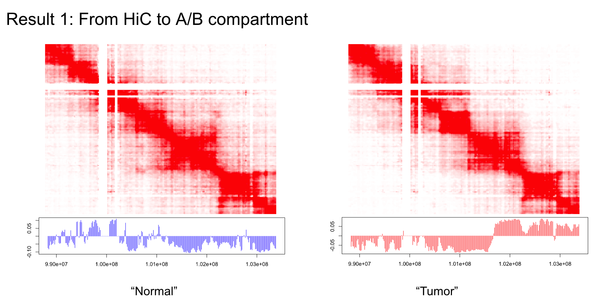

# HiC-PON: Hi-C Tumor-Specific Signal Detection

## Motivation
Hi-C datasets are usually in low resolution, filled with noise, and are difficult to call variants and/or unique interactions. Methods for differential comparison of Hi-C datasets are usually limited. In particular, given a group of datasets of "normal" (PON, or panel of normal), and a "tumor" dataset, how to get the tumor-specific signal in Hi-C dataset?

## Method
Inspiration was taken from this paper: [Detection of fetal subchromosomal abnormalities by sequencing circulating cell-free DNA from maternal plasma](https://pubmed.ncbi.nlm.nih.gov/25710461/), where PCA/SVD was used to establish the normal aspect of copy number events. The top PCA ranks intuitively represent euploidy and were subsequently removed from the test set by linear regression. As a result, the residue of the signals is tumor-specific. For more detail, please refer to the paper as well as the code in this repo.

## Results

## Disclaimer
This code is licensed under the [Attribution-NonCommercial 4.0 International (CC BY-NC 4.0)](https://creativecommons.org/licenses/by-nc/4.0/) license. 
